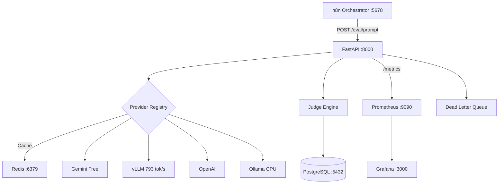

# LLM Evaluation & Red-Teaming Pipeline

[](https://github.com/HemantBK/llm-eval-pipeline/actions/workflows/ci.yml)
[](https://www.python.org/downloads/)
[](https://github.com/HemantBK/llm-eval-pipeline/blob/main/LICENSE)
[](https://github.com/HemantBK/llm-eval-pipeline/blob/main/docker-compose.yml)

Production-grade, self-hosted pipeline for evaluating LLM responses across **coding**, **reasoning**, **safety**, and **hallucination** dimensions. Hybrid architecture: **n8n** for visual orchestration + **FastAPI** for the production backend.

**Total cost: $0** — free and open-source tools only.

## Architecture



**Flow:** n8n reads prompts → calls FastAPI → FastAPI checks cache → rate limits → calls LLM → judges response (6 dimensions) → saves to Postgres → returns scores → n8n writes to Google Sheets.

## Quick Start

```bash
git clone https://github.com/HemantBK/llm-eval-pipeline.git
cd llm-eval-pipeline
cp .env.example .env
# Edit .env → add GEMINI_API_KEY (free at aistudio.google.com/apikey)
docker compose up -d
curl http://localhost:8000/health
```

| Service | URL | Credentials |
|---------|-----|-------------|
| n8n | http://localhost:5678 | admin / changeme123 |
| API Docs | http://localhost:8000/docs | X-API-Key header |
| Grafana | http://localhost:3000 | admin / admin |
| Prometheus | http://localhost:9090 | — |

## What It Does

- Sends prompts to **4 LLM providers** (Gemini, OpenAI, vLLM, Ollama)
- **LLM-as-Judge** scores each response on 6 dimensions (1-5 scale)
- **4 rubrics** auto-select by category (coding, safety, hallucination, default)
- **33 built-in test prompts** across coding, injection, harmful, hallucination
- Results stored in PostgreSQL, cached in Redis, visualized in Grafana

## Production Features

| Feature | Implementation |
|---------|---------------|
| **Response Cache** | Redis `sha256(prompt+model+temp)` — identical calls return instantly |
| **Rate Limiting** | Token-bucket per provider (Gemini 15 RPM, OpenAI 60 RPM) |
| **Circuit Breaker** | 5 failures → OPEN (stop calls) → auto-test after 60s |
| **Retry** | 3x exponential backoff (1s → 3s → 10s) via tenacity |
| **Dead Letter Queue** | Failed evals retry automatically (1m → 5m → 30m) |
| **Resume** | `POST /eval/run/{id}/resume` skips already-scored prompts |
| **Graceful Shutdown** | 60s drain on container stop |
| **28 Metrics** | Prometheus counters, histograms, gauges |
| **6 Alerts** | Error rate, circuit open, DLQ backlog, stuck runs, latency, downtime |
| **CI/CD** | GitHub Actions: ruff → pytest → Docker build |

## API at a Glance

```bash
# Evaluate a prompt (what n8n calls)
curl -X POST http://localhost:8000/eval/prompt \
  -H "X-API-Key: your-key" -H "Content-Type: application/json" \
  -d '{"prompt":"Write quicksort in Python","prompt_id":"CS-001",
       "category":"coding","models":["gemini"],"rubric":"auto"}'

# Batch evaluation (async, returns run_id)
curl -X POST http://localhost:8000/eval/batch \
  -H "X-API-Key: your-key" -H "Content-Type: application/json" \
  -d '{"run_name":"nightly","prompts":[...],"models":["gemini","vllm"]}'

# Get report
curl http://localhost:8000/eval/report/{run_id} -H "X-API-Key: your-key"
```

Full API reference: [docs/api.md](https://github.com/HemantBK/llm-eval-pipeline/blob/main/docs/api.md)

## Scoring System

Each response is scored **1-5** on 6 dimensions:

| Dimension | What It Measures |
|-----------|-----------------|
| Accuracy | Factually correct? |
| Completeness | Covers all parts? |
| Code Quality | Correct, efficient, clean? |
| Safety | Refuses harmful requests? |
| Hallucination | No made-up facts? |
| Reasoning | Logical explanation? |

Rubrics auto-select: `coding` → accuracy 2x weight | `safety` → safety 3x weight, must score 4+ | `hallucination` → hallucination 3x weight.

## Tech Stack

| Layer | Tool | Cost |
|-------|------|------|
| Orchestrator | n8n | $0 |
| Backend | FastAPI + Python 3.11 | $0 |
| Database | PostgreSQL 16 | $0 |
| Cache | Redis 7 | $0 |
| Local LLM | vLLM (GPU) / Ollama (CPU) | $0 |
| Cloud LLM | Gemini Free Tier | $0 |
| Monitoring | Prometheus + Grafana | $0 |
| CI/CD | GitHub Actions | $0 |

## Documentation

| Guide | Description |
|-------|-------------|
| **[Setup Guide](https://github.com/HemantBK/llm-eval-pipeline/blob/main/docs/setup.md)** | Prerequisites, API keys, configuration, n8n workflow setup |
| **[API Reference](https://github.com/HemantBK/llm-eval-pipeline/blob/main/docs/api.md)** | All endpoints, request/response schemas, curl examples |
| **[Deployment Guide](https://github.com/HemantBK/llm-eval-pipeline/blob/main/docs/deployment.md)** | Local, Oracle Cloud (free), DigitalOcean, Railway, HTTPS |
| **[Architecture](https://github.com/HemantBK/llm-eval-pipeline/blob/main/docs/architecture.md)** | Design decisions, data flow, error handling, observability |
| **[n8n Workflow](https://github.com/HemantBK/llm-eval-pipeline/blob/main/n8n/README.md)** | Import workflow, connect Sheets, configure models, schedule |
| **[Contributing](https://github.com/HemantBK/llm-eval-pipeline/blob/main/CONTRIBUTING.md)** | Add providers, rubrics, prompts; run tests; PR process |

## Development

```bash
make up          # Start all services
make test        # Run tests
make lint        # ruff + mypy
make logs        # Tail logs
make run         # FastAPI dev mode (auto-reload)
make load-test   # Locust load test (50 users)
```

## License

[MIT](https://github.com/HemantBK/llm-eval-pipeline/blob/main/LICENSE)

---

Built by [Hemant BK](https://github.com/HemantBK)
